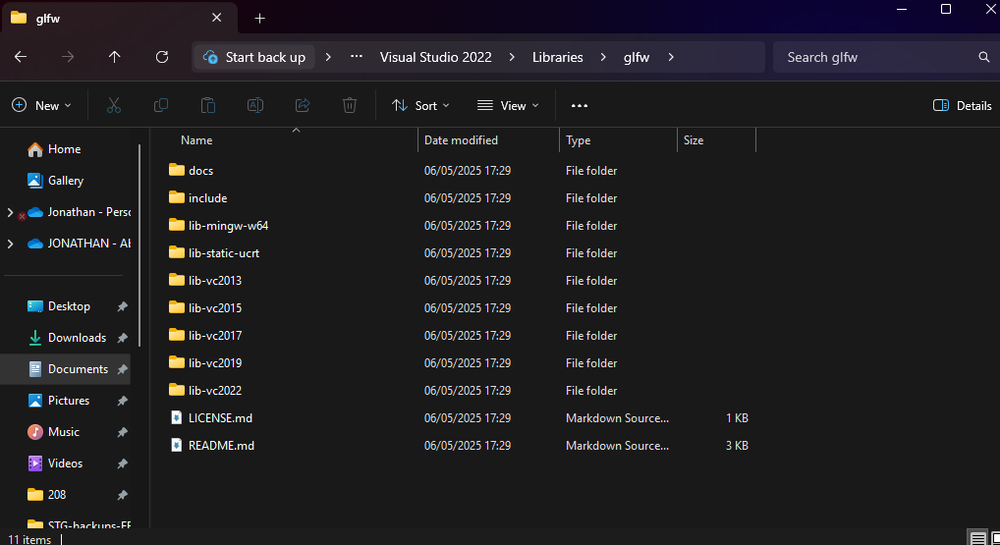
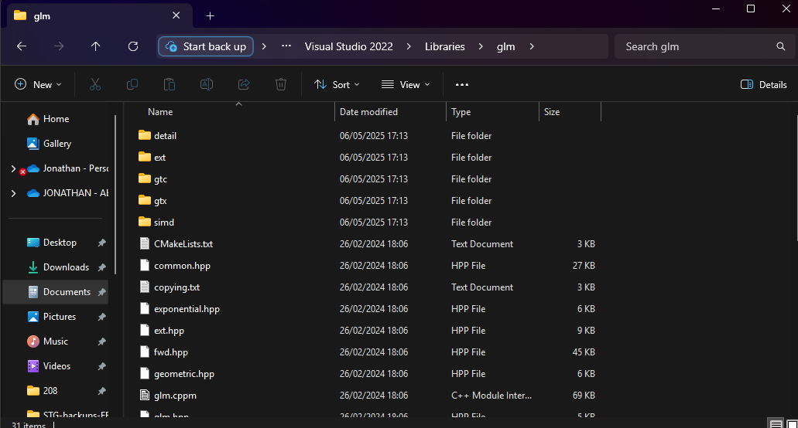
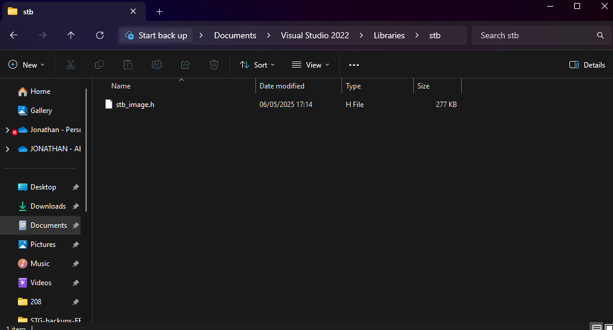

NikoEngine is a little project that I'm doing in my spare time, built from the ground up using Vulkan.

# Dependancies
- [VulkanSDK 1.4.309.0](https://vulkan.lunarg.com/sdk/home)
- [GLM 1.0.1](https://github.com/g-truc/glm)
- [glfw-3.4](https://www.glfw.org/download.html) - 64 bit windows binaries
- [stb](https://github.com/nothings/stb) - single-file public domain (or MIT licensed) libraries for C/C (only stb_image.h required)
- [tiny-obj-loader](https://github.com/tinyobjloader/tinyobjloader/blob/release/tiny_obj_loader.h)
- Visual Studio 2022
    - With [GLSL Language Integration](https://marketplace.visualstudio.com/items?itemName=DanielScherzer.GLSL2022)

### Preinstalled

- [Dear ImGui](https://github.com/ocornut/imgui/tree/docking) - Docking version

# How to Setup
Install the VulkanSDK to your "C:/" drive using Vulkans installer.

Find your "Visual Studio 2022" folder (Should be in your documents).
Within this folder create a "Libraries" folder, and create 4 more folders in "Libraries";
- glm
- glfw
- stb
- loaders

Place all relevent files in these three folders from the above dependancies.

View of What Folders Should Look Like

    

